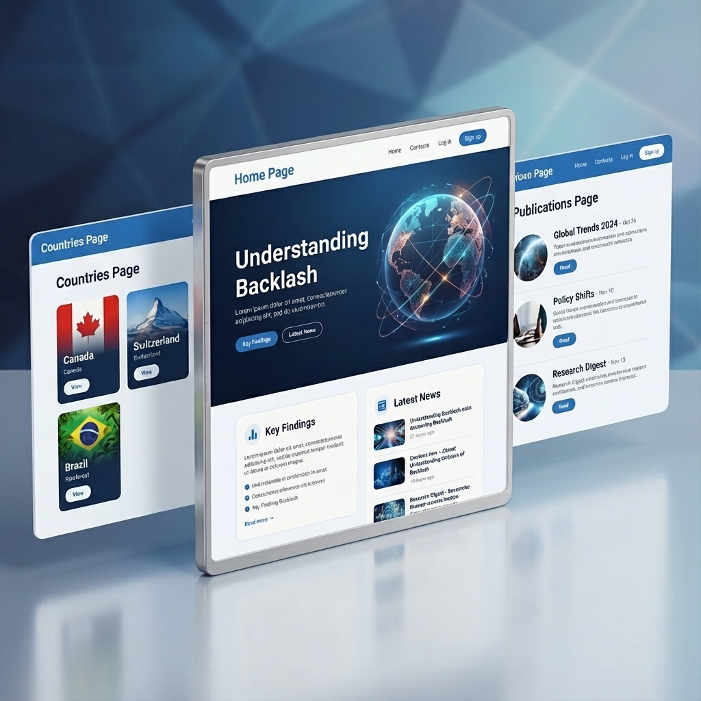

# Backlash - Global Legal & Policy Analysis Platform




**Backlash** is a cutting-edge web platform dedicated to the visualization, analysis, and management of global legal and policy data. Designed for researchers, policymakers, and the public, it bridges the gap between complex data and accessible, interactive insights.

Whether exploring geopolitical shifts through our interactive map or diving deep into specific country reports, Backlash provides a seamless, multilingual experience powered by modern web technologies.

---

## 📑 Table of Contents

- [✨ Key Features](#-key-features)
- [🏗️ Architecture & Tech Stack](#-architecture--tech-stack)
- [📂 Project Structure](#-project-structure)
- [🚀 Getting Started](#-getting-started)
- [💻 Development](#-development)
- [🌍 Internationalization (i18n)](#-internationalization-i18n)
- [🔒 Security & Admin](#-security--admin)
- [🚀 Deployment](#-deployment)
- [👥 Team](#-team)

---

## ✨ Key Features

### 🗺️ Interactive Global Intelligence
*   **Dynamic World Map**: A fully interactive SVG-based map allowing users to select any country.
*   **Data Visualization**: Color-coded geopolitical indicators.
*   **Zoom & Pan**: Smooth controls for detailed regional exploration.

### 📚 Comprehensive Knowledge Base
*   **Country Profiles**: Detailed pages for each nation containing:
    *   Economic Indicators (GDP, Population).
    *   Legal & Policy Summaries.
    *   Rich Media (Images, detailed content).
*   **Publication Hub**: A centralized library for:
    *   **News**: Latest updates and briefings.
    *   **Events**: Upcoming webinars and conferences.
    *   **Articles**: In-depth academic papers.
    *   **Books**: Recommended reading and publications.

### 🔐 Robust Administration
*   **Secure Dashboard**: Protected routes for content management.
*   **Content Management System (CMS)**:
    *   Create, Read, Update, Delete (CRUD) for Publications and Team Members.
    *   File Uploads (Images & Documents) seamlessly integrated with Firebase Storage.
    *   Rich Text editing support.

### 🎨 Modern User Experience
*   **Responsive Design**: Mobile-first architecture ensures a perfect experience on phones, tablets, and desktops.
*   **Dark/Light Mode**: (Ready for implementation) Built on a flexible theme system.
*   **Accessibility**: WCAG compliant components using Material UI.

---

## 🏗️ Architecture & Tech Stack

Backlash is a Single Page Application (SPA) built for performance and scalability.

| Layer | Technology | Description |
| :--- | :--- | :--- |
| **Frontend Core** | **React 19** | The latest version of the library for building user interfaces. |
| **Build Tool** | **Vite** | Next-generation frontend tooling for instant server start and lightning-fast HMR. |
| **Language** | **TypeScript** | Statically typed JavaScript for robust and maintainable code. |
| **UI Framework** | **Material UI (v6)** | A comprehensive library of accessible and customizable components. |
| **Routing** | **React Router v7** | Standard routing library for keeping the UI in sync with the URL. |
| **State Management** | **Context API** | Lightweight global state management for Auth and Data. |
| **Data Viz** | **React Simple Maps** | Declarative API for generating SVG maps. |
| **Backend (SaaS)** | **Firebase** | Fully managed backend (Firestore, Auth, Storage, Hosting). |

---

## 📂 Project Structure

```bash
src/
├── assets/             # Static assets (images, geoJSON, locales)
│   ├── geo/            # TopoJSON files for the map
│   ├── images/         # Project images (team, slides)
│   └── locales/        # i18n JSON files (en, fr, de)
├── components/         # Atomic Design Structure
│   ├── atoms/          # Basic building blocks (Buttons, Icons)
│   ├── molecules/      # Simple combinations (Search bars, Cards)
│   ├── organisms/      # Complex sections (Map, Footer, AdminDialogs)
│   └── templates/      # Page layouts (MainLayout)
├── contexts/           # Global State (AuthContext, DataContext)
├── data/               # Mock data for seeding and testing
├── pages/              # Main Route Views (Home, Countries, Publications)
├── services/           # Firebase Interaction Layer
│   ├── countryService.ts
│   ├── publicationService.ts
│   └── ...
├── tests/              # Test Suite (Vitest)
└── utils/              # Helper functions
```

---

## 🚀 Getting Started

Follow these instructions to get a copy of the project running on your local machine.

### Prerequisites

*   **Node.js**: v18.0.0 or higher
*   **npm**: v9.0.0 or higher
*   **Git**

### Installation

1.  **Clone the repository**
    ```bash
    git clone https://github.com/Mouness/backlash.git
    cd backlash
    ```

2.  **Install dependencies**
    ```bash
    npm install
    ```

3.  **Environment Configuration**
    Create a `.env` file in the root directory. You will need keys from your Firebase Console.
    
    *Template:*
    ```env
    VITE_FIREBASE_API_KEY=your_api_key
    VITE_FIREBASE_AUTH_DOMAIN=your_project.firebaseapp.com
    VITE_FIREBASE_PROJECT_ID=your_project_id
    VITE_FIREBASE_STORAGE_BUCKET=your_storage_bucket
    VITE_FIREBASE_MESSAGING_SENDER_ID=your_sender_id
    VITE_FIREBASE_APP_ID=your_app_id
    VITE_FIREBASE_MEASUREMENT_ID=your_measurement_id
    ```

4.  **Run the App**
    ```bash
    npm run dev
    ```
    Open [http://localhost:5173](http://localhost:5173) in your browser.

---

## 💻 Development

### Commands

*   `npm run dev`: Starts the development server.
*   `npm run build`: Compiles the app for production (TypeScript + Vite).
*   `npm run lint`: Runs ESLint to check for code quality issues.
*   `npm run test`: Executes the test suite with Vitest.
*   `npm run preview`: Preview the production build locally.

---

## 🌍 Internationalization (i18n)

The platform supports **English**, **French**, and **German** out of the box.

*   Translations are stored in `src/assets/locales/{lang}/translation.json`.
*   Language detection automatically respects the user's browser settings.
*   Content in the database is structured to support multiple languages for titles and descriptions.

---

## 🔒 Security & Admin

*   **Authentication**: Managed via Firebase Auth. Only authorized emails can access the Admin Dashboard.
*   **Database Rules**: Firestore security rules ensure that:
    *   **Public**: Can read all publications and country data.
    *   **Admins**: Can write/edit/delete data.

---

## � Deployment

The project is pre-configured for **Firebase Hosting**.

1.  **Build**
    ```bash
    npm run build
    ```

2.  **Deploy**
    ```bash
    firebase deploy --only hosting
    ```

For detailed deployment steps, please refer to the internal `deployment_guide.md` artifact.

---

## 👥 Team

Developed with ❤️ by the Backlash Team.

---
*© 2025 Backlash. All Rights Reserved.*
